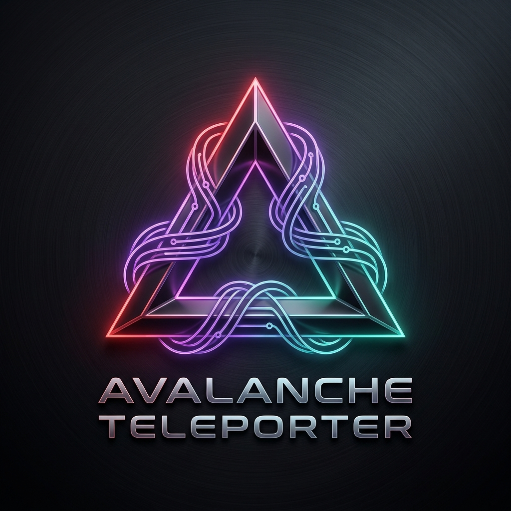

# Avalanche L1 & Teleporter Playground & Visualizer



An interactive developer visualizer and smart contract generator for modeling, simulating, and estimating Retro9000 yields on custom Avalanche L1 blockchains (formerly Subnets) using **Teleporter** and **Avalanche Warp Messaging (AWM)**.

Designed for the **Avalanche9000** ecosystem upgrade.

---

## 🚀 Concept & Ecosystem Value

Avalanche9000 makes launching custom sovereign L1 Blockchains incredibly cheap, fast, and scalable. However, interchain communication using **Teleporter** can be abstract and difficult for new developers to grasp. 

This project solves this developer experience (DX) challenge by providing a **no-setup visual playground** where builders can:
1. **Model** their multi-chain L1 architecture.
2. **Simulate** step-by-step cryptographic warp messaging flows.
3. **Generate** Solidity contract templates (`Sender` and `Receiver`) dynamically based on their parameters.
4. **Calculate** annual gas burns and estimated Retro9000 developer rebate yields.

This tool is a perfect addition for developers looking to learn Avalanche interchain mechanics, submit to hackathons, or pitch L1 subnet ideas to validators.

---

## ✨ Features

- **Interactive Topology Builder**: Dynamically deploy custom L1 chains with customized native gas token symbols.
- **Step-by-Step Message Visualizer**: Watch messages transition across four crucial phases:
  1. **Tx Dispatch**: Initiation from source contracts.
  2. **BLS Signing**: Multi-signature collection by the Avalanche L1 validator set.
  3. **Relay Message**: Message pickup and delivery by off-chain Relayers.
  4. **Warp Receive**: Target contract receipt, payload decoding, and state modifications.
- **Dynamic Code Generator**: Instant Solidity files using standard `@teleporter/contracts` libraries for basic text payloads, ERC-20 token bridges, and custom multi-argument data structs.
- **Retro9000 Rebate Calculator**: Slider controls to predict AVAX gas burn and prospective annual developer rewards (modeled at the standard 80% rebate rate).
- **Zero-Dependency Architecture**: Built entirely with Vanilla HTML5, CSS3, and ES6 Javascript Modules. Loads instantly and runs in any modern browser without npm build overhead.

---

## 📂 Project Structure

```bash
avax/
├── index.html        # Main dashboard viewport, configurations, and overlay modals
├── styles.css        # Premium Dark Tech-Glassmorphic styles, custom fonts, and animations
├── README.md         # Documentation
└── js/
    ├── app.js        # Main coordinator, state manager, and UI event binder
    ├── simulator.js  # SVG-based animation engine (requestAnimationFrame, Bezier paths)
    ├── codegen.js    # Solidity contract template engine and syntax highlighter
    └── calculator.js # Economics calculator for gas burns and Retro9000 rebates
```

---

## 🛠️ Getting Started

### Prerequisites
No node installations, compilation setups, or Docker requirements are needed. Just a browser!

### Running Locally
You can serve the static files using any local web server:

**Using Python (Quickest):**
```bash
python -m http.server 8000
```
Then navigate to `http://localhost:8000` in your browser.

**Using Node.js (Alternative):**
```bash
npx http-server -p 8000
```

### GitHub Pages Deployment
Since this is a client-side static application, you can publish it to GitHub Pages in seconds:
1. Push this repository to GitHub.
2. Go to **Settings** > **Pages** in your repository.
3. Select the source branch (usually `main`), directory `/root`, and click **Save**.
4. Your application will be live at `https://<your-username>.github.io/<your-repo-name>/`!

---

## 🛡️ License

This project is licensed under the MIT License - see the LICENSE file for details.
All Solidity contract templates follow official Ava Labs Teleporter guidelines and practices.
